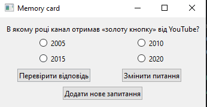

# Основна функція коду
__Код створює программу з інтерфейсом__
## Вміст 
__У программі ми маємо 4 запитання і лише 1 відповідь правильна, також ми маємо три кнопки: ***перевірити відповідь***, ***додати питання***, ***змінити питання***.__
### Функції
__При виборі любого неправильного питання програма напише нам, що відповідь не правильна. Так само навпаки при правильній все парвильно. Кнопка перевірити відповідь відстежує перевірене питання та надсилає вам повідомлення з перевіркою(вікном з резултатом). Кнопка додати питання додає ваші власні питання, ви можете додати будь яке. Кнопка змінити питання дуже схожа на додати питання, вона дозволяє вам змінити любе з питань, якщо ви (або розробник) напартачили з питанням.__
#### Бібліотеки які були використані
__Pyqt6, для бази данних ми використали SQT, для перевірки питань використали умовні оператори.__
